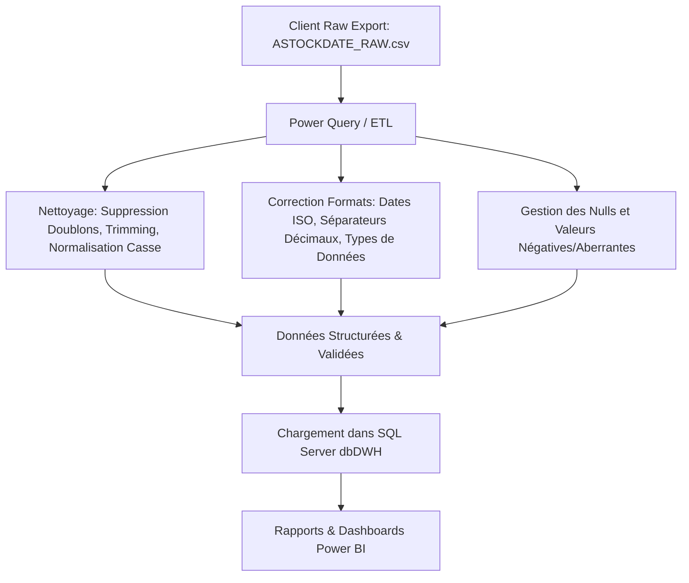

# Rapport sur la Qualité des Données — `ASTOCKDATE_RAW.csv` (Grand Volume)

## 📌 Présentation du Jeu de Données Brut
Ce document récapitule l'ensemble des problèmes de qualité de données introduits volontairement dans le fichier grand volume **`ASTOCKDATE_RAW.csv`** (51,500 lignes).

Ce jeu de données simule une extraction brute ("Raw Export") grand volume directement issue du système d'information client **Microsoft SQL Server / ERP Navision** avant tout nettoyage ou transformation dans **Power Query**.

---

## 📊 Synthèse de la Qualité des Données

* **Nombre total de lignes** : `51,500`
* **Proportion de données conformes** : `~75% - 80%`
* **Proportion de données avec anomalies** : `~20% - 25%`

---

## 🔍 Détail des Anomalies Intentionnelles Introduites

### 1. Données Manquantes (Missing Data / NULLs)
* **Nombre de lignes impactées** : `~1,425 lignes`
* **Description** : Présence de valeurs vides ou `NULL` dans des colonnes essentielles.
* **Exemples** :
  * `Description` vide pour certains articles.
  * `GroupeItem` ou `Gen_Prod_Posting Group` non assignés.
  * `Site` ou `GroupeClient` manquant.
  * `Quantité` ou `Cout` omis.

---

### 2. Doublons (Duplicate Data)
* **Nombre de lignes impactées** : `~1,500 lignes`
* **Description** :
  * Lignes totalement identiques répétées dans l'export.
  * Répétition de la même clé `No_` avec des informations secondaires divergentes.
* **Exemples** :
  * Ligne exacte `ART-1001` dupliquée à des positions différentes.

---

### 3. Incohérences de Texte (Text Inconsistencies & Formatting)
* **Nombre de lignes impactées** : `~1,397 lignes`
* **Description** : Casse inconsistante, espaces superflus et saisies manuelles désordonnées.
* **Exemples** :
  * Espaces de début/fin : `" Boulon M8x30 Inox 316  "`
  * Espaces doubles internes : `"Vis  Tête  Fraisée"`
  * Casse mixte : `"boulon m8x30 inox 316"`, `"BOULON M8X30 INOX 316"`

---

### 4. Formatage et Validité des Dates (Date Problems)
* **Nombre de lignes impactées** : `~1,330 lignes`
* **Description** : Mélange de formats de dates et valeurs invalides.
* **Exemples** :
  * Format ISO standard : `2026-01-15`
  * Format Français slash : `15/01/2026`
  * Format Français tiret : `15-01-2026`
  * Date impossible : `2026-02-30`
  * Date manquante : `""`

---

### 5. Incohérences Numériques (Numeric Problems)
* **Nombre de lignes impactées** : `~1,433 lignes`
* **Description** : Formats décimaux incorrects, unités concaténées, valeurs négatives ou aberrantes.
* **Exemples** :
  * Séparateur décimal virgule : `"125,50"` au lieu de `125.50`
  * Texte concaténé dans la quantité : `"500 u"`
  * Quantités négatives : `-50.0` (représentant une erreur de saisie d'inventaire)
  * Valeurs aberrantes (Outliers) : `999999`

---

### 6. Incohérences sur les Coûts (Cost Problems)
* **Nombre de lignes impactées** : `~1,413 lignes`
* **Description** : Coûts zéro, négatifs, unités monétaires collées et valeurs démesurées.
* **Exemples** :
  * Coût nul : `0.00`
  * Coût négatif : `-125.50`
  * Suffixe devise : `"45.00 TND"`
  * Valeur extrême : `850000.00` pour un simple article de visserie.

---

### 7. Variances sur les Catégories (`GroupeItem` / `Gen_Prod_Posting Group`)
* **Nombre de lignes impactées** : `~1,409 lignes`
* **Description** : Catégories écrites avec différentes casses ou légères fautes de frappe.
* **Exemples** :
  * `"VISSERIE"`, `"visserie"`, `"  VISSERIE  "`, `"VYSSEYRIE"`

---

### 8. Variances sur les Sites de Stockage (`Site`)
* **Nombre de lignes impactées** : `~1,374 lignes`
* **Description** : Variations d'appellation des dépôts et magasins.
* **Exemples** :
  * `"DEPOT A"`, `"depot a"`, `"Dépôt A"`, `" DEPOT A "`

---

### 9. Problèmes d'Identifiants (`No_`)
* **Nombre de lignes impactées** : `~1,320 lignes`
* **Description** : Références d'articles écrites en minuscules, entourées d'espaces ou absentes.
* **Exemples** :
  * `"art-1005"`, `" ART-1005 "`, `""`

---

### 10. Incohérences Logiques (Logical Inconsistencies)
* **Nombre de lignes impactées** : `~1,376 lignes`
* **Description** : Désaccord entre deux colonnes censées représenter la même métrique ou valeurs hors limites.
* **Exemples** :
  * Incohérence entre `Quantité` (ex: `500.0`) et `Quantit` (ex: `50.0`).
  * Valeur anormale pour la colonne `Encours` : `99` (au lieu de 0 ou 1).

---

## 🎯 Processus de Nettoyage et Transformation Cible (Power Query Workflow)

Ce document sert de guide de référence pour votre démonstration et votre rapport de **PFE** afin de justifier l'intérêt et la méthodologie des étapes de nettoyage automatisées sous **Power Query**.
