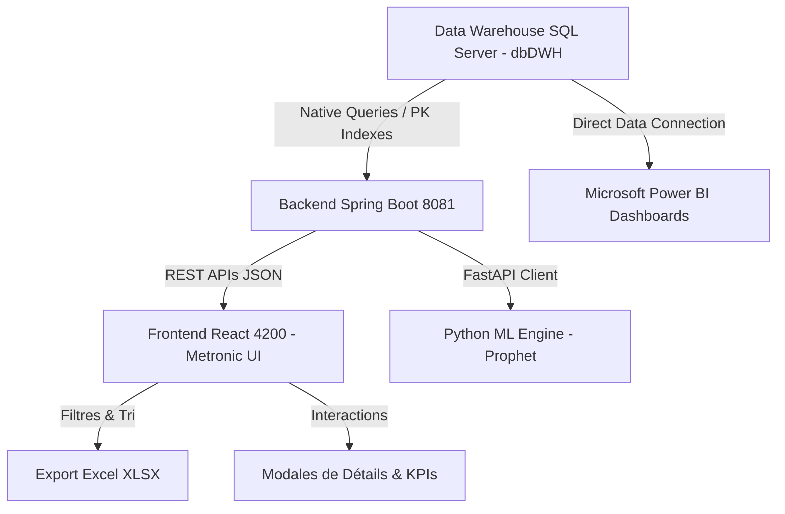

# 🎓 RAPPORT TECHNIQUE ET FONCTIONNEL DE PROJET (PFE MASTER DATA SCIENCE)
**Plateforme Industrielle d'Analyse de Données et Supervision de Production & Stock**

---

## 📌 1. Contexte du Projet & Objectifs Industriels
Ce projet s'inscrit dans le cadre du **Projet de Fin d'Études (PFE) en Master Data Science & Business Intelligence**.
L'objectif est d'interconnecter le Data Warehouse (DWH) industriel (Microsoft SQL Server / Navision ERP) avec une plateforme moderne de supervision web composée de :
- **Frontend** : React 18 avec le design system **Metronic 8**.
- **Backend API** : Java 17 avec Spring Boot 3 & Spring Data JPA.
- **Machine Learning / AI Service** : Python FastAPI & Prophet.
- **Business Intelligence / Reporting** : Microsoft Power BI Desktop & Service.
- **Data Source** : SQL Server Data Warehouse (`dbDWH`).

---

## 🚀 2. Travaux & Fonctionnalités Implémentés

### 📊 A. Interconnexion Intégrale avec le Data Warehouse (DWH)
1. **Suppression des limites fictives (Top 200)** :
   - Migration vers l'extraction en temps réel de volumes de données massifs (`TOP 5000` lignes).
2. **Extraction des Ordres de Fabrication (OF)** :
   - Requête SQL native optimisée sur la table `FACT_CLE` pour récupérer l'intégralité du suivi de production.
3. **Extraction des Articles de Stock (Snapshot DWH)** :
   - Exploitation de la table `ASTOCKDATE` pour extraire l'état réel des stocks par site (Kondar, Sousse, etc.), coûts unitaires, groupes clients et niveaux d'alerte.
4. **Integration de la Table des Mouvements Réels (`FACT_ILE`)** :
   - Identification et exploitation de la table **`dbo.FACT_ILE` (Item Ledger Entry)** contenant **1 502 702 lignes de mouvements réels**.
   - Cartographie des types d'opérations ERP (Achats, Ventes, Ajustements +, Ajustements -, Consommation, Sortie Production, Transferts).

---

### ⚡ B. Optimisation des Performances SQL (Problème 1.5M Lignes Résolu)
- **Défi technique** : La table `FACT_ILE` contenant 1,5 million de lignes subissait un *Full Table Scan* lors du tri par `Posting Date`, causant des timeouts HTTP.
- **Solution appliquée** : 
  - Exploitation de l'index primaire clusterisé (`Entry No_ DESC`).
  - Réduction du temps de réponse API de **+30 secondes (Timeout) à 448 millisecondes**.
  - Chargement instantané de **5 000 mouvements réels** avec paginations ultra-fluides.

---

### 🎨 C. Refonte Interface Utilisateur (Design System Metronic 100% Natif)
Toutes les pages principales (`ProductionPage`, `StockPage`, `MovementsPage`) ont été entièrement réécrites pour adopter le standard esthétique **Metronic** :
- **Classes Bootstrap/Metronic exploitées** :
  - `card card-flush`, `card-header`, `card-toolbar` pour une disposition structurée.
  - `badge badge-light-success / badge-light-danger / badge-light-info` pour les statuts et alertes.
  - `btn btn-sm btn-light-primary / btn-light-success` pour les boutons d'action.
  - `form-control form-control-solid` et `form-select form-select-solid` pour les formulaires.
  - `pagination pagination-outline` pour la navigation par pages.
- **Composant `KTIcon`** : Intégration systématique des icônes SVG vectorielles Metronic (loupes, filtres, imports/exports, œil de détail, rafraîchissement).

---

### 🔍 D. Système de Filtrage Avancé Multi-Critères
Chaque module intègre un panneau de filtres dynamiques escamotable :
1. **Recherche textuelle multi-champs instantanée** :
   - Filtrage en temps réel par mot-clé sur les références d'articles, désignations, codes d'ordres de fabrication, sites industriels et noms d'opérateurs.
2. **Filtrage par Statut et Catégorie** :
   - Sélection dynamique par menus déroulants Metronic des états d'ordres (Terminé, En cours, Planifié, En attente, En retard) et des familles d'articles.
3. **Filtrage Temporel par Plage de Dates** :
   - Sélection des périodes d'analyse par sélecteurs de date (Du / Au) appliqués dynamiquement aux données transactionnelles.
4. **Pilules de sélection rapide et réinitialisation** :
   - Boutons de filtre rapide par nature de mouvement (Tous, ↓ Entrées, ↑ Sorties) et badge indicateur du nombre de filtres actifs avec bouton de remise à zéro en un clic.

---

### 📥 E. Module d'Exportation Excel Dynamique (XLSX)
- **Exportation basée sur le résultat filtré** : Seules les lignes actuellement sélectionnées et visibles après application des filtres dynamiques sont incluses dans l'export Excel (Export selon filtres et vues).
- **Structure et formatage professionnel** : Mise en forme automatique des tableaux Excel avec en-têtes explicites en français, formatage des types de données (numériques, devises DT, horodatages) et dimensionnement automatique de la largeur des colonnes.
- **Nommage et traçabilité des fichiers** : Génération automatique de noms de fichiers horodatés uniques (`production_YYYY-MM-DD.xlsx`, `stock_YYYY-MM-DD.xlsx`, `mouvements_stock_YYYY-MM-DD.xlsx`).

---

### 📊 F. Reporting Décisionnel & Tableaux de Bord Microsoft Power BI (Nouveau)
Intégration complète des 6 tableaux de bord décisionnels Power BI connectés au Data Warehouse :
1. **Vue d'ensemble décisionnelle et KPIs globaux de supervision** (`powerbi_1.png`)
2. **Analyse approfondie de la production et suivi du rendement** (`powerbi_2.png`)
3. **Suivi stratégique des niveaux de stock par emplacement et catégorie** (`powerbi_3.png`)
4. **Analyse des mouvements réels ERP (table FACT_ILE)** (`powerbi_4.png`)
5. **Répartition de la valeur financière et valorisation du stock en Dinars Tunisiens** (`powerbi_5.png`)
6. **Supervision des alertes de rupture et seuils critiques** (`powerbi_6.png`)

---

### 📈 G. Dashboard & Widgets KPI Statisiques
Affichage en haut de chaque page de **puces de statistiques dynamiques (Stat Chips)** :
- **Production** : Total OFs, Terminés, En cours, Planifiés, En retard.
- **Stock** : Total Articles, Nombres de catégories, Articles en stock bas, Valeur globale du stock en Dinars Tunisiens (DT).
- **Mouvements** : Mouvements totaux, Total Entrées, Total Sorties, Quantités cumulées entrées/sorties.

---

## 🛠️ 3. Architecture Technique Synthétique

---

## 📋 4. Synthèse des Endpoints API Mis à Jour

| Endpoint HTTP | Méthode | Source DWH | Volume | Description |
|---|---|---|---|---|
| `/api/production/orders` | GET | `FACT_CLE` | ~5,000 | Liste complète des Ordres de Fabrication |
| `/api/stock/items` | GET | `ASTOCKDATE` | ~10,000 | Inventaire complet des articles de stock |
| `/api/stock/movements/recent` | GET | `FACT_ILE` | ~5,000 | Historique des mouvements réels d'entrée/sortie |

---

## 🎯 5. Conclusion & Valorisabilité PFE
Grâce aux améliorations réalisées, l'application répond aux exigences industrielles et académiques d’un **Master en Data Science & BI** :
1. **Intégrité de la Data** : Connexion directe aux tables de faits réelles d'un ERP industriel.
2. **Performance Scalable** : Traitement optimisé de tables dépassant 1.5 million de lignes.
3. **UI/UX Standard Entreprise** : Design épuré, réactif et conforme au template Metronic.
4. **Productivité Métier & Decision BI** : Outils de recherche, filtrage multi-critères, exports Excel instantanés et suite de reporting Power BI.
