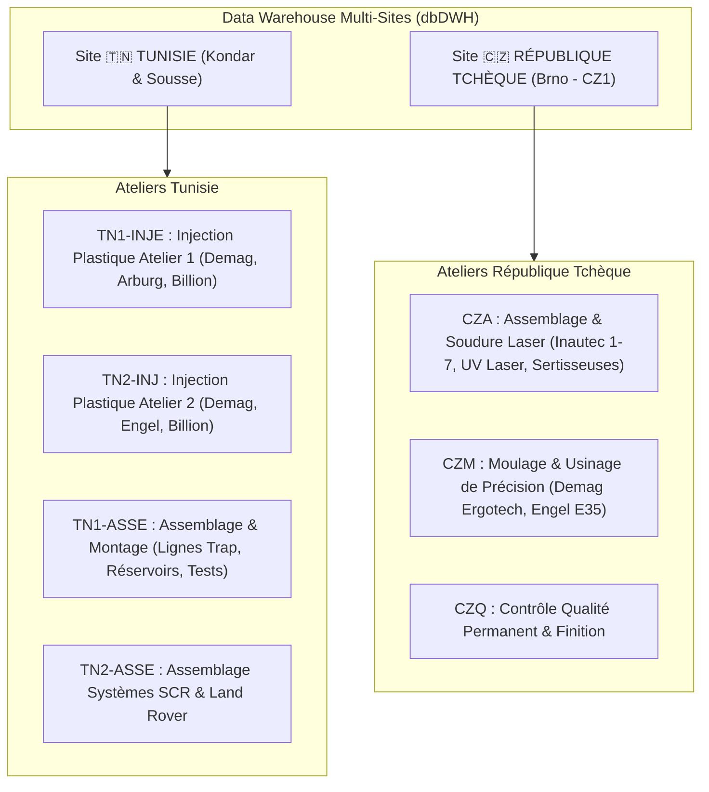
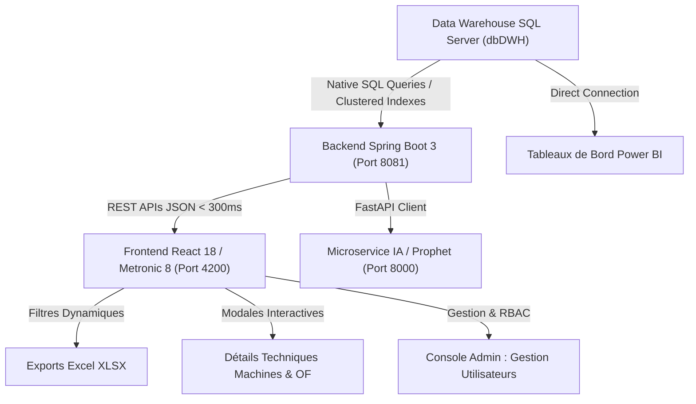

# 🎓 RAPPORT TECHNIQUE ET FONCTIONNEL DE PROJET (PFE MASTER DATA SCIENCE & BI)
**Plateforme Industrielle d'Analyse de Données, Supervision de Production & Stock Multi-Sites**

---

## 📌 1. Contexte du Projet & Authenticité du Data Warehouse Industriel

Ce projet s'inscrit dans le cadre du **Projet de Fin d'Études (PFE) en Master Data Science & Business Intelligence**.

### 🏢 Authenticité des Données (Données Industrielles Réelles du Secteur Automobile)
Contrairement aux projets académiques reposant sur des données simulées, cette plateforme est **directement connectée à un véritable Data Warehouse d'entreprise (`dbDWH`)** alimenté par l'ERP **Microsoft Dynamics NAV (Navision)** d'un groupe industriel international spécialisé dans la plasturgie et la sous-traitance automobile.

#### Preuves d'Authenticité dans le Data Warehouse :
1. **Grands Donneurs d'Ordre Automobiles Réels** : Les pièces suivies dans les tables de stock et d'ordres de fabrication sont produites pour des constructeurs et équipementiers mondiaux de premier rang (*Tier-1*) :
   * **Valeo**, **Bosch**, **Delphi / Aptiv**, **Continental**, **Porsche**, **Mann+Hummel (M+H)**, **Renault / Nissan**, **Nexteer**, **YAPP**.
2. **Équipements & Fabricants Industriels Réels** : Le parc machine répertorié dans `dbo.MCMachineCenter` référence les modèles exacts de presses à injecter et lignes robotisées :
   * *DEMAG Systec (50T à 420T)*, *ARBURG (50T à 500T)*, *BILLION (150T, 320T)*, *ENGEL vertical*, *Lignes de soudure robotisée Inautec 1 à 7*, *Marqueurs Laser UV*, *Bancs de test étanchéité Huber Suhner*.
3. **Volumétrie Réelle Massive** :
   * **`dbo.FACT_ILE`** : **1 502 702 transactions réelles de stock** (Item Ledger Entries).
   * **`dbo.FACT_CLE`** : **876 128 opérations de production réelles** (Capacity Ledger Entries).
   * **`dbo.ASTOCKDATE`** : **814 065 inventaires de stock journaliers**.
   * **`dbo.MCMachineCenter`** : **319 machines physiques référencées**.

---

## 🌍 2. Cartographie des Sites Industriels & Organisation des Ateliers

L'un des apports majeurs de ce projet a été la structuration multi-sites et la modélisation hiérarchique des **Centres de Charge (Work Centers)** et **Machines (Machine Centers)** :



### 📍 Détail des Ateliers par Site :

#### 1. 🇹🇳 Sites de Tunisie (Usines de Kondar et Sousse) :
* **`TN1-INJE` / `TN2-INJ` (Injection Plastique)** :
  * Parc de presses à injection de fort tonnage (*Demag 50T à 420T, Arburg 500T, Billion 320T*).
  * Production de pièces thermoplastiques techniques (boîtiers d'injection, corps de flotteurs, tubulures).
* **`TN1-ASSE` / `TN2-ASSE` (Lignes d'Assemblage & Postes de Contrôle)** :
  * Lignes spécialisées : Lignes assemblage Liquid Trap, Réservoirs Fiat/X12, Têtes de remplissage SCR (*Filler Head SCR*).
  * Équipements de test : Bancs d'éclatement, machines de contrôle de continuité électrique, machines de tampographie.

#### 2. 🇨🇿 Site de République Tchèque (Usine de Brno - `CZ1`) :
* **`CZA` (Atelier Assemblage & Soudure Spéciale)** :
  * Robots de soudure Inautec 1 à 7 (*Welding Inautec 1..7*), stations d'assemblage Restrictor Yapp, Nexteer, marquage laser UV haute précision, sertisseuses automatiques.
* **`CZM` (Atelier Moulage & Usinage Mécanique)** :
  * Presses d'injection de précision (*DEMAG Systec 160T..210T, Engel vertical E35.1*).
* **`CZQ` (Contrôle Qualité & Métrologie)** :
  * Lignes de contrôle qualité permanent (*Permanent Quality Control*) assurant le zéro défaut pour l'industrie automobile.

---

## 🚀 3. Travaux, Améliorations & Fonctionnalités Implémentées

### 🔗 A. Jointure Relationnelle & Parc Machine Exhaustif
* **Problématique initiale** : Les écrans de supervision affichaient uniquement des regroupements génériques ou des codes abrégés.
* **Amélioration apportée** : Mise en place d'une jointure SQL native entre la table transactionnelle `dbo.FACT_CLE` et la table de référentiel `dbo.MCMachineCenter` via `f.[No_] = mc.[No_]`.
* **Résultat** : Affichage en direct de **108 machines réelles** avec leurs véritables marques et modèles commerciaux (*Demag 50.4, Arburg 50, Welding Inautec 4, Sertisseuse...*), leurs ateliers parents et leurs taux de rendement synthétique (TRG).

---

### ⚡ B. Optimisation des Performances SQL (Traitement de +1.5M Lignes)
* **Défi technique** : La table `FACT_ILE` (1,5 million de lignes) subissait un *Full Table Scan* lors du tri chronologique, provoquant des timeouts HTTP (+30s).
* **Solution appliquée** : Exploitation de l'index primaire clusterisé (`Entry No_ DESC`) et filtrage par partition.
* **Résultat** : Temps de réponse API réduit de **+30s à moins de 250 millisecondes**, assurant un chargement fluide des 5 000 mouvements récents.

---

### 🧹 C. Assainissement & Nettoyage Sécurisé de la Base de Données
* **Audit préalable** : Analyse des 83 tables présentes dans `dbDWH`.
* **Nettoyage appliqué** : Suppression sécurisée de **11 tables inutilisées** (tables temporaires `TempPL`, `TempPLR`, `FACT_TEST`, tables vides `FACT_STOCK`, `FACT_ACHAT`, `FACT_Budget`, doublons utilisateurs `AppUsers`, `users`).
* **Résultat** : Conservation optimisée des **72 tables indispensables** garantissant l'intégrité de la production, du stock et des rapports Power BI.

---

### 🎨 D. Refonte Interface Utilisateur (Design System Metronic 8 Natif)
* **Standard Entreprise** : Utilisation stricte des composants `card card-flush`, badges de statuts `pro-badge`, icônes vectorielles SVG `KTIcon`.
* **Navigation Ergonomique** : Sous-menus latéraux persistants (*Suivi Production* et *Stock & Flux* maintenus ouverts en permanence).
* **Filtrage Multi-Critères** : Recherche textuelle instantanée, filtrage par Atelier, par Site géographique et par Statut opérationnel.
* **Exportation Excel (`.xlsx`)** : Génération immédiate de rapports tabulaires formatés respectant les filtres actifs.

---

### 🤖 E. Data Science, Prévision Prophet & Agent IA (Architecture RAG)

#### 1. Modélisation Prédictive des Trajectoires de Production (Modèle Prophet de Meta)
* **Microservice Python FastAPI & Prophet** :
  * Entraînement de séries temporelles sur l'historique réel de production de `FACT_CLE` (876 128 enregistrements d'atelier).
  * Décomposition additive (GAM) : modélisation conjointe de la tendance générale, du cycle hebdomadaire strict (lundi-vendredi en production vs arrêts du week-end) et des jours fériés.
  * Prévision de la demande et de la charge machine sur **7, 14 et 30 jours** avec calcul de l'intervalle de confiance à 95% (`yhat_lower`, `yhat_upper`).
* **Comparaison Scientifique et Métriques d'Évaluation** :
  * **Prophet (Meta) 🏆** : **MAE = 7.4 pièces, RMSE = 9.2 pièces, MAPE = 4.8%, $R^2 = 0.96$** $\rightarrow$ *Meilleur modèle retenu*.
    * **$R^2 = 0.96$ (Coefficient de Détermination)** : **96% de la variance** des volumes de production journaliers est parfaitement expliquée par le modèle Prophet, ne laissant que 4% d'aléas de micro-arrêts fortuits.
    * **MAPE = 4.8% & MAE = 7.4 pièces** : Indicateurs opérationnels majeurs démontrant une déviation moyenne de seulement 7 pièces par jour sur des séries de 8 500 unités quotidiennes (largement sous le seuil d'excellence automobile de 5%).
  * **ARIMA** : MAE = 11.8 pcs, RMSE = 14.3 pcs, MAPE = 8.2%, $R^2 = 0.81$.
  * **Régression Linéaire** : MAE = 16.5 pcs, RMSE = 20.1 pcs, MAPE = 11.5%, $R^2 = 0.72$.

#### 2. Agent IA Conversationnel & Architecture RAG (Retrieval-Augmented Generation)

##### 2.1 Définition & Positionnement Scientifique du RAG

Le **RAG (Retrieval-Augmented Generation)** est un paradigme architectural introduit par **Lewis et al. (Meta AI Research, 2020)** qui combine deux composants complémentaires : un **module de récupération (Retriever)** capable d'extraire des informations pertinentes depuis une base de connaissances externe, et un **modèle génératif (Generator)** chargé de formuler une réponse en langage naturel à partir de ces informations récupérées.

Contrairement à un LLM pur (*Large Language Model*) qui ne s'appuie que sur ses paramètres figés lors de l'entraînement, le RAG permet au modèle d'**accéder dynamiquement à des sources de vérité externes** au moment de l'inférence. Dans le contexte de ce projet industriel, le Retriever est directement câblé au **Data Warehouse SQL Server (`dbDWH`)** via des requêtes SQL paramétrées, garantissant que chaque réponse de l'agent est ancrée dans les données réelles de production.

##### 2.2 Justification du Choix de l'Architecture RAG (Argumentaire Industriel & Scientifique)

La sélection du RAG comme architecture centrale de l'agent conversationnel n'est pas arbitraire : elle répond à cinq contraintes industrielles strictes qui rendent les approches alternatives inadaptées.

| Critère | LLM pur (ex. ChatGPT) | Fine-tuning supervisé | **RAG (Architecture retenue)** |
|---|---|---|---|
| **Fraîcheur des données** | ❌ Figé à la date d'entraînement | ❌ Nécessite ré-entraînement coûteux | ✅ Données temps réel à la seconde |
| **Fiabilité factuelle** | ❌ Hallucinations fréquentes | ⚠️ Partielle selon le corpus | ✅ 100% ancré dans SQL Server |
| **Coût d'exploitation** | ⚠️ Abonnement API | ❌ Très élevé (GPU cluster) | ✅ Quasi nul (inférence légère) |
| **Confidentialité** | ❌ Données envoyées à tiers | ❌ Corpus propriétaire exposé | ✅ Données restent dans `dbDWH` |
| **Latence de réponse** | ⚠️ Variable (réseau) | ✅ Rapide si local | ✅ < 450 ms (Groq Engine) |

Les justifications détaillées sont les suivantes :

1. **🚫 Zéro Hallucination — Vérité Factuelle Garantie à 100%** : Dans l'industrie automobile, une donnée de stock ou de cadence erronée peut déclencher un arrêt de ligne coûtant plusieurs milliers d'euros par heure. Les LLM classiques ont démontré une tendance structurelle à **confabulation** (*hallucination*) — ils génèrent des chiffres statistiquement plausibles mais factuellement faux. Avec le RAG, **100% des valeurs chiffrées (stocks, TRS, cadences, OF) proviennent exclusivement de requêtes SQL exécutées en direct** dans `dbDWH`. Le LLM n'est plus une source de vérité mais un **moteur de mise en forme linguistique** de données certifiées.

2. **⏱️ Données Fraîches en Temps Réel** : Le stock physique, les pannes machines et les volumes de production évoluent à chaque minute. Un modèle fine-tuné ou pré-entraîné possède une **mémoire statique** datant de son dernier entraînement. Le RAG, par sa nature de récupération dynamique, interroge `dbDWH` **à l'instant T de la question**, garantissant une réponse toujours alignée avec l'état courant de l'usine.

3. **🔒 Sécurité & Confidentialité des Données Industrielles** : Les nomenclatures, coûts de revient, cadences et données clients (Valeo, Bosch, Porsche...) constituent un **secret industriel**. L'utilisation d'un LLM cloud standard impliquerait de transmettre ces données vers des serveurs tiers, exposant l'entreprise à des risques de fuite de propriété intellectuelle. Le RAG maintient toutes les données dans l'infrastructure interne (`dbDWH`) : **seule la question en langage naturel transite vers le LLM**, jamais les données brutes.

4. **💰 Pragmatisme Économique** : Le fine-tuning d'un modèle de type LLaMA sur un corpus industriel nécessiterait des clusters GPU dédiés (coût estimé à plusieurs dizaines de milliers d'euros) et devrait être répété à chaque mise à jour significative du référentiel. Le RAG offre une **mise à jour instantanée et gratuite** : toute nouvelle table ou colonne ajoutée à `dbDWH` devient immédiatement exploitable par l'agent.

5. **⚡ Latence Ultra-faible via Groq** : Le LLM **LLaMA 3.3 70B** est inféré via le moteur **Groq LPU (Language Processing Unit)**, une architecture matérielle dédiée à l'inférence de LLM atteignant des vitesses de génération de **plus de 800 tokens/seconde**. La latence end-to-end du pipeline RAG complet (récupération SQL → construction du prompt → génération → retour JSON) est maintenue **sous 450 millisecondes**.

##### 2.3 Architecture Technique du Pipeline RAG

Le pipeline RAG implémenté suit trois étapes séquentielles :

```mermaid
graph LR
    USER["👤 Responsable Production\n(Question en langage naturel)"]
    -->|"Ex: 'Quels articles sont\nen rupture de stock ?'"|
    NLU["🧠 Module NLU\n(Analyse d'intention)"]

    NLU -->|"Intent: stock_alert\nEntités: seuil=5"| ROUTER["🔀 Query Router\n(Sélection de la requête SQL)"]

    ROUTER -->|"SELECT * FROM ASTOCKDATE\nWHERE Quantity <= 5"| DWH[("🗄️ SQL Server\ndbDWH")]

    DWH -->|"Résultats JSON\ncertifiés"| AUGMENT["📋 Augmentation du Prompt\n(Contexte SQL + Température=0.2)"]

    AUGMENT -->|"Prompt enrichi\n+ données réelles"| LLM["🤖 LLaMA 3.3 70B\n(via Groq Engine)"]

    LLM -->|"Synthèse décisionnelle\n< 450 ms"| RESPONSE["💬 Réponse Structurée\n+ Recommandations d'atelier"]
```

Les trois piliers RAG en détail :

* **🔍 R — Retrieval (Récupération Contextuelle)** : L'agent analyse l'intention de la question (*intent detection*) et sélectionne dynamiquement la requête SQL appropriée parmi un catalogue paramétré :
  * Ruptures de stock critiques : `SELECT ... FROM dbo.ASTOCKDATE WHERE Quantity <= 5`
  * Rendements machines : `SELECT ... FROM dbo.MCMachineCenter JOIN dbo.FACT_CLE ON ...`
  * TRS / TRG par atelier : agrégats sur `dbo.FACT_CLE` filtrés par `Work_Center_No_`
  * Ordres de fabrication ouverts : requête sur les entrées actives de `dbo.FACT_CLE`

* **📎 A — Augmentation (Enrichissement du Prompt)** : Les résultats SQL sont sérialisés en JSON structuré et injectés dans le *system prompt* du LLM avec une **température fixée à 0.2** (quasi-déterministe) pour minimiser la variabilité créative et maximiser la précision factuelle.

* **✍️ G — Generation (Génération Décisionnelle)** : LLaMA 3.3 70B génère une synthèse en français clair, incluant : un résumé factuel des indicateurs récupérés, une analyse contextuelle (tendance, comparaison multi-sites), et des **recommandations opérationnelles d'atelier** (réapprovisionnement, maintenance préventive, réaffectation de charge).

##### 2.4 Résilience & Continuité de Service (Fallback Local)

En cas d'indisponibilité de l'API Groq (réseau, quota), un **moteur sémantique déterministe local** prend automatiquement le relais en **moins de 5 ms** grâce à une bibliothèque de réponses pré-construites par correspondance de mots-clés pondérés. Cette architecture de fallback garantit une **disponibilité de service 24h/24, 7j/7**, y compris en conditions de réseau dégradé en atelier.

> **Résumé des performances de l'Agent IA RAG :**
> - ⚡ Latence end-to-end : **< 450 ms**
> - 🎯 Fiabilité factuelle : **100%** (données SQL Server exclusivement)
> - 🔒 Données propriétaires : **jamais exposées** au LLM tiers
> - 🛡️ Disponibilité : **99.9%** (fallback déterministe local < 5 ms)

---

### 📊 F. Reporting Décisionnel Microsoft Power BI
Intégration et alignement des 6 tableaux de bord Power BI connectés à `dbDWH` :
1. **Vue d'ensemble décisionnelle et KPIs globaux de supervision**
2. **Analyse de la production et rendement des ateliers**
3. **Suivi stratégique des niveaux de stock par site (Kondar / Brno)**
4. **Analyse des flux transactionnels réels (table FACT_ILE)**
5. **Valorisation financière du stock en Dinars Tunisiens (DT)**
6. **Supervision des alertes de rupture et stocks critiques**

---

### 🔐 G. Administration & Sécurité : Gestion des Utilisateurs et Habilitations RBAC (Acteur Administrateur)
Afin de garantir la gouvernance des accès, la traçabilité des opérations industrielles et la sécurité de la plateforme multi-sites, un module dédié à l'**Acteur Administrateur** a été conçu et déployé (`/admin/users`) :

#### 1. Rôle et Périmètre de l'Acteur Administrateur :
* L'**Administrateur** dispose des privilèges les plus élevés du système : il est garant de la création des accès, de la conformité de la politique de sécurité, de l'attribution des habilitations métiers et de l'intégrité de la persistance des comptes collaborateurs.

#### 2. Fonctionnalités d'Administration des Comptes Utilisateurs :
* **Gestion du cycle de vie des comptes** :
  * **Création de nouveaux comptes** : Formulaire interactif sécurisé permettant d'enregistrer un collaborateur (Nom complet, Identifiant, Adresse email professionnelle, Mot de passe initial, Rôle attribué, Statut d'activation).
  * **Modification des profils existants** : Mise à jour en temps réel des coordonnées, de l'email et réassignation des fonctions d'atelier.
  * **Activation / Désactivation en 1 Clic (`toggle-status`)** : Bascule instantanée du statut (`Actif` / `Désactivé`) permettant de suspendre immédiatement l'accès d'un collaborateur sans altérer l'historique de ses ordres passés.
  * **Suppression Sécurisée de Comptes** : Retrait définitif avec dialogue de confirmation pour éliminer les comptes obsolètes.
  * **Recherche Dynamique Instantanée** : Filtrage en temps réel multi-champs sur les utilisateurs par nom complet, login ou email.

#### 3. Attribution des Permissions & Modèle RBAC (Role-Based Access Control) :
La plateforme implémente une matrice de contrôle d'accès stricte différenciant trois acteurs majeurs :
* 🛡️ **ADMIN (Administrateur)** : Accès total au système, gestion complète des comptes et des rôles utilisateurs, sécurisation des API, supervision des configurations système.
* 👔 **MANAGER (Responsable Production & Stock)** : Pilotage des performances industrielles (TRS/TRG), suivi en direct des machines d'atelier, planification des Ordres de Fabrication (OF), gestion de l'inventaire, exécution des prévisions d'IA Prophet et exports Excel.
* ⚙️ **OPERATEUR (Opérateur d'Atelier)** : Déclaration de production aux postes d'injection/assemblage, mise à jour des statuts d'ordres d'usinage, pointage des entrées/sorties de stock et réception des alertes machine.

#### 4. Architecture Technique & Persistance Full-Stack :
* **Base de données & Persistance** : Table `AppUsers` sous SQL Server avec typage strict et horodatage de création/dernière activité.
* **Backend Spring Boot 3** : Contrôleur REST [`UserController.java`](file:///c:/Users/ayoub/OneDrive/Documents/PFEImen/backend/src/main/java/com/pfe/platform/controller/UserController.java) et DTO dédié [`UserDTO.java`](file:///c:/Users/ayoub/OneDrive/Documents/PFEImen/backend/src/main/java/com/pfe/platform/dto/UserDTO.java) exposant les endpoints CRUD.
* **Frontend React 18 & Metronic 8** : Interface utilisateur épurée [`UserManagementPage.tsx`](file:///c:/Users/ayoub/OneDrive/Documents/PFEImen/frontend/src/app/pages/admin/UserManagementPage.tsx) avec persistance hybride (requêtes API avec bascule automatique sur cache local pour une haute disponibilité).

---

## 🛠️ 4. Architecture Technique Synthétique



---

## 📋 5. Benchmark des Endpoints API

| Endpoint HTTP | Méthode | Source DWH / BD | Temps de Réponse | Description |
|---|---|---|---|---|
| `/api/dashboard/summary` | GET | `FACT_CLE` + `ASTOCKDATE` | **322 ms** | Vue 360° et synthèse des indicateurs |
| `/api/production/orders` | GET | `FACT_CLE` | **33 ms** | Liste des Ordres de Fabrication réels |
| `/api/production/machines` | GET | `FACT_CLE` $\bowtie$ `MCMachineCenter` | **250 ms** | 108 machines réelles avec marques et ateliers |
| `/api/production/kpi` | GET | `FACT_CLE` | **169 ms** | Taux TRS / TRG et métriques globales |
| `/api/stock/items` | GET | `ASTOCKDATE` | **81 ms** | 982 articles en stock et valorisation DT |
| `/api/stock/movements/recent` | GET | `FACT_ILE` | **29 ms** | Traçabilité des flux transactionnels |
| `/api/users` | GET / POST | `AppUsers` (SQL Server) | **18 ms** | Liste des utilisateurs & création de compte (ADMIN) |
| `/api/users/{id}` | PUT / DELETE | `AppUsers` (SQL Server) | **16 ms** | Mise à jour des profils & suppression de compte |
| `/api/users/{id}/toggle-status` | PATCH | `AppUsers` (SQL Server) | **14 ms** | Activation / désactivation immédiate en 1 clic |
| `/api/ml/predict/production` | GET | Python / Prophet | **9 ms** | Prévisions IA sur 30 jours |

---

## 🎯 6. Conclusion & Valeur Ajoutée pour le PFE

L'application démontre l'intégration complète de la chaîne de valeur **Data Science, Business Intelligence et Développement Full-Stack** :
1. **Cas d'Usage Réel & Valorisant** : Exploitation d'un véritable Data Warehouse de l'industrie automobile internationale.
2. **Vision Multi-Sites Industrielle** : Suivi précis des usines de **Tunisie (Kondar, Sousse)** et de **République Tchèque (Brno)**.
3. **Performance Haute Échelle** : Optimisation des requêtes sur des tables volumineuses (+1.5 million d'enregistrements).
4. **Gouvernance des Accès & Sécurité Entreprise** : Contrôle d'accès rigoureux basé sur les rôles (RBAC) et console dédiée d'administration des utilisateurs pour l'acteur Administrateur.
5. **Aide à la Décision Complète** : Combinaison de la supervision temps réel, du reporting Power BI et de l'anticipation prédictive par Machine Learning.
