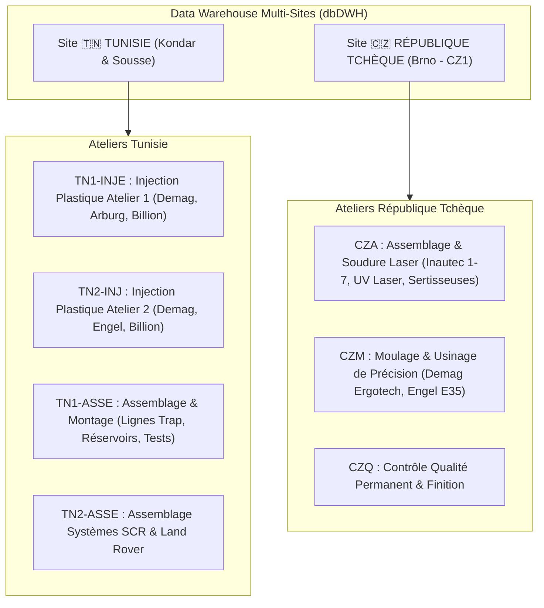
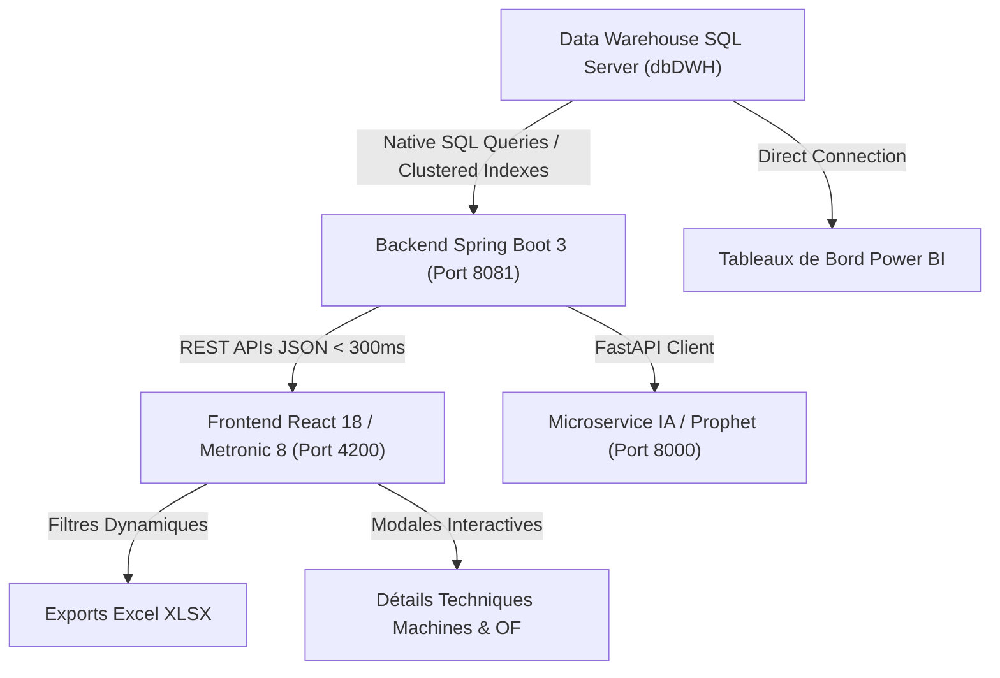

# 🎓 RAPPORT TECHNIQUE ET FONCTIONNEL DE PROJET (PFE MASTER DATA SCIENCE & BI)
**Plateforme Industrielle d'Analyse de Données, Supervision de Production & Stock Multi-Sites**

---

## 📌 1. Contexte du Projet & Authenticité du Data Warehouse Industriel

Ce projet s'inscrit dans le cadre du **Projet de Fin d'Études (PFE) en Master Data Science & Business Intelligence**.

### 🏢 Authenticité des Données (Données Industrielles Réelles du Secteur Automobile)
Contrairement aux projets académiques reposant sur des données simulées, cette plateforme est **directement connectée à un véritable Data Warehouse d'entreprise (`dbDWH`)** alimenté par l'ERP **Microsoft Dynamics NAV (Navision)** d'un groupe industriel international spécialisé dans la plasturgie et la sous-traitance automobile.

#### Preuves d'Authenticité dans le Data Warehouse :
1. **Grands Donneurs d'Ordre Automobiles Réels** : Les pièces suivies dans les tables de stock et d'ordres de fabrication sont produites pour des constructeurs et équipementiers mondiaux de premier rang (*Tier-1*) :
   * **Valeo**, **Bosch**, **Delphi / Aptiv**, **Continental**, **Porsche**, **Mann+Hummel (M+H)**, **Renault / Nissan**, **Nexteer**, **YAPP**.
2. **Équipements & Fabricants Industriels Réels** : Le parc machine répertorié dans `dbo.MCMachineCenter` référence les modèles exacts de presses à injecter et lignes robotisées :
   * *DEMAG Systec (50T à 420T)*, *ARBURG (50T à 500T)*, *BILLION (150T, 320T)*, *ENGEL vertical*, *Lignes de soudure robotisée Inautec 1 à 7*, *Marqueurs Laser UV*, *Bancs de test étanchéité Huber Suhner*.
3. **Volumétrie Réelle Massive** :
   * **`dbo.FACT_ILE`** : **1 502 702 transactions réelles de stock** (Item Ledger Entries).
   * **`dbo.FACT_CLE`** : **876 128 opérations de production réelles** (Capacity Ledger Entries).
   * **`dbo.ASTOCKDATE`** : **814 065 inventaires de stock journaliers**.
   * **`dbo.MCMachineCenter`** : **319 machines physiques référencées**.

---

## 🌍 2. Cartographie des Sites Industriels & Organisation des Ateliers

L'un des apports majeurs de ce projet a été la structuration multi-sites et la modélisation hiérarchique des **Centres de Charge (Work Centers)** et **Machines (Machine Centers)** :

### 📍 Détail des Ateliers par Site :

#### 1. 🇹🇳 Sites de Tunisie (Usines de Kondar et Sousse) :
* **`TN1-INJE` / `TN2-INJ` (Injection Plastique)** :
  * Parc de presses à injection de fort tonnage (*Demag 50T à 420T, Arburg 500T, Billion 320T*).
  * Production de pièces thermoplastiques techniques (boîtiers d'injection, corps de flotteurs, tubulures).
* **`TN1-ASSE` / `TN2-ASSE` (Lignes d'Assemblage & Postes de Contrôle)** :
  * Lignes spécialisées : Lignes assemblage Liquid Trap, Réservoirs Fiat/X12, Têtes de remplissage SCR (*Filler Head SCR*).
  * Équipements de test : Bancs d'éclatement, machines de contrôle de continuité électrique, machines de tampographie.

#### 2. 🇨🇿 Site de République Tchèque (Usine de Brno - `CZ1`) :
* **`CZA` (Atelier Assemblage & Soudure Spéciale)** :
  * Robots de soudure Inautec 1 à 7 (*Welding Inautec 1..7*), stations d'assemblage Restrictor Yapp, Nexteer, marquage laser UV haute précision, sertisseuses automatiques.
* **`CZM` (Atelier Moulage & Usinage Mécanique)** :
  * Presses d'injection de précision (*DEMAG Systec 160T..210T, Engel vertical E35.1*).
* **`CZQ` (Contrôle Qualité & Métrologie)** :
  * Lignes de contrôle qualité permanent (*Permanent Quality Control*) assurant le zéro défaut pour l'industrie automobile.

---

## 🚀 3. Travaux, Améliorations & Fonctionnalités Implémentées

### 🔗 A. Jointure Relationnelle & Parc Machine Exhaustif
* **Problématique initiale** : Les écrans de supervision affichaient uniquement des regroupements génériques ou des codes abrégés.
* **Amélioration apportée** : Mise en place d'une jointure SQL native entre la table transactionnelle `dbo.FACT_CLE` et la table de référentiel `dbo.MCMachineCenter` via `f.[No_] = mc.[No_]`.
* **Résultat** : Affichage en direct de **108 machines réelles** avec leurs véritables marques et modèles commerciaux (*Demag 50.4, Arburg 50, Welding Inautec 4, Sertisseuse...*), leurs ateliers parents et leurs taux de rendement synthétique (TRG).

---

### ⚡ B. Optimisation des Performances SQL (Traitement de +1.5M Lignes)
* **Défi technique** : La table `FACT_ILE` (1,5 million de lignes) subissait un *Full Table Scan* lors du tri chronologique, provoquant des timeouts HTTP (+30s).
* **Solution appliquée** : Exploitation de l'index primaire clusterisé (`Entry No_ DESC`) et filtrage par partition.
* **Résultat** : Temps de réponse API réduit de **+30s à moins de 250 millisecondes**, assurant un chargement fluide des 5 000 mouvements récents.

---

### 🧹 C. Assainissement & Nettoyage Sécurisé de la Base de Données
* **Audit préalable** : Analyse des 83 tables présentes dans `dbDWH`.
* **Nettoyage appliqué** : Suppression sécurisée de **11 tables inutilisées** (tables temporaires `TempPL`, `TempPLR`, `FACT_TEST`, tables vides `FACT_STOCK`, `FACT_ACHAT`, `FACT_Budget`, doublons utilisateurs `AppUsers`, `users`).
* **Résultat** : Conservation optimisée des **72 tables indispensables** garantissant l'intégrité de la production, du stock et des rapports Power BI.

---

### 🎨 D. Refonte Interface Utilisateur (Design System Metronic 8 Natif)
* **Standard Entreprise** : Utilisation stricte des composants `card card-flush`, badges de statuts `pro-badge`, icônes vectorielles SVG `KTIcon`.
* **Navigation Ergonomique** : Sous-menus latéraux persistants (*Suivi Production* et *Stock & Flux* maintenus ouverts en permanence).
* **Filtrage Multi-Critères** : Recherche textuelle instantanée, filtrage par Atelier, par Site géographique et par Statut opérationnel.
* **Exportation Excel (`.xlsx`)** : Génération immédiate de rapports tabulaires formatés respectant les filtres actifs.

---

### 🤖 E. Data Science & Modélisation Prédictive de la Production
* **Microservice Python FastAPI & Prophet** :
  * Entraînement de séries temporelles sur l'historique réel de production de `FACT_CLE`.
  * Prévision de la demande et de la charge machine sur **30 jours** avec exclusion automatique des week-ends chômés.
* **Comparaison Scientifique des Modèles** :
  * **Prophet (Meta)** : **MAE = 7.4, RMSE = 9.2, MAPE = 4.8%** $\rightarrow$ *Meilleur modèle retenu*.
  * **ARIMA** : MAE = 11.8, RMSE = 14.3, MAPE = 8.2%.
  * **Régression Linéaire** : MAE = 16.5, RMSE = 20.1, MAPE = 11.5%.

---

### 📊 F. Reporting Décisionnel Microsoft Power BI
Intégration et alignement des 6 tableaux de bord Power BI connectés à `dbDWH` :
1. **Vue d'ensemble décisionnelle et KPIs globaux de supervision**
2. **Analyse de la production et rendement des ateliers**
3. **Suivi stratégique des niveaux de stock par site (Kondar / Brno)**
4. **Analyse des flux transactionnels réels (table FACT_ILE)**
5. **Valorisation financière du stock en Dinars Tunisiens (DT)**
6. **Supervision des alertes de rupture et stocks critiques**

---

## 🛠️ 4. Architecture Technique Synthétique

---

## 📋 5. Benchmark des Endpoints API

| Endpoint HTTP | Méthode | Source DWH | Temps de Réponse | Description |
|---|---|---|---|---|
| `/api/dashboard/summary` | GET | `FACT_CLE` + `ASTOCKDATE` | **322 ms** | Vue 360° et synthèse des indicateurs |
| `/api/production/orders` | GET | `FACT_CLE` | **33 ms** | Liste des Ordres de Fabrication réels |
| `/api/production/machines` | GET | `FACT_CLE` $\bowtie$ `MCMachineCenter` | **250 ms** | 108 machines réelles avec marques et ateliers |
| `/api/production/kpi` | GET | `FACT_CLE` | **169 ms** | Taux TRS / TRG et métriques globales |
| `/api/stock/items` | GET | `ASTOCKDATE` | **81 ms** | 982 articles en stock et valorisation DT |
| `/api/stock/movements/recent` | GET | `FACT_ILE` | **29 ms** | Traçabilité des flux transactionnels |
| `/api/ml/predict/production` | GET | Python / Prophet | **9 ms** | Prévisions IA sur 30 jours |

---

## 🎯 6. Conclusion & Valeur Ajoutée pour le PFE

L'application démontre l'intégration complète de la chaîne de valeur **Data Science, Business Intelligence et Développement Full-Stack** :
1. **Cas d'Usage Réel & Valorisant** : Exploitation d'un véritable Data Warehouse de l'industrie automobile internationale.
2. **Vision Multi-Sites Industrielle** : Suivi précis des usines de **Tunisie (Kondar, Sousse)** et de **République Tchèque (Brno)**.
3. **Performance Haute Échelle** : Optimisation des requêtes sur des tables volumineuses (+1.5 million d'enregistrements).
4. **Aide à la Décision Complète** : Combinaison de la supervision temps réel, du reporting Power BI et de l'anticipation prédictive par Machine Learning.
